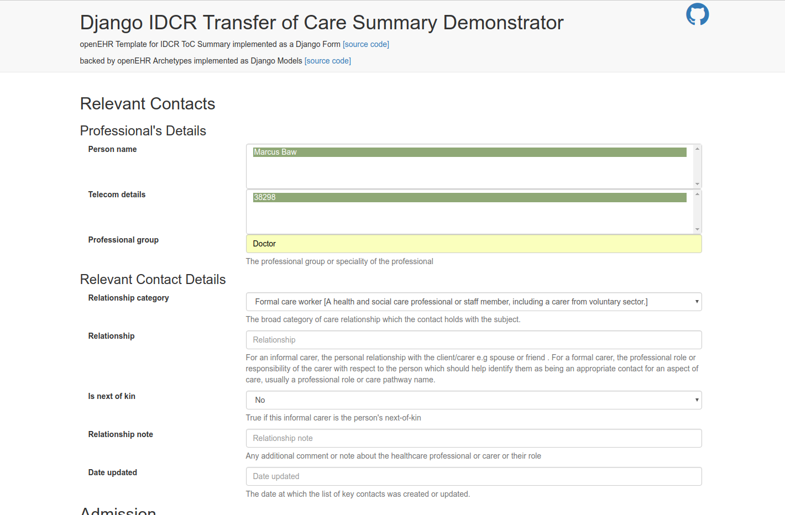

# Django-openEHR Demo Application

Experimental | Not officially supported by OHCUK

[Try out the live demo](https://djopenehr.herokuapp.com/IDCR-transfer-of-care/)

This repository contains a demo application for the [django-openehr](https://pypi.python.org/pypi/django_openehr) models library.

To try this application:

* `git clone` this repo into a suitable folder
* `cd` into the cloned directory
* (create a new virtualenv, if you are a virtualenv user)
* `pip install -r requirements.txt` to install dependencies
* `python manage.py migrate` to set up the database (this application is set up to use PostgresQL, so if you don't have this installed you may need to install it for your platform - I suggest googling for instructions specific to your platform. Alternatively, if you are familiar with Django you can change the DATABASES information in `settings.py` to an alternative DB)
* `python manage.py createsuperuser` (enter some super user details)
* `python manage.py runserver`
* navigate to `localhost:8000/admin/` to log in and interact with the models using the Django admin interface.
* navigate to `localhost:8000/IDCR-transfer-of-care/` to see the Django Form that has been (semi)-automatically created using the information in the Django Models. (Semi-automatic in that the fields, validation and helptext are all drawn from the Models automatically. Structure and layout of the form were, of course, manual)
* upon submission of valid data in the form, you will be redirected to a simple detail view of that data.
* You can also use the Django shell (`python manage.py shell` to manipulate the new classes.)

-----
## Screenshot

-----

# Template: IDCR Transfer of Care summary (minimal)
(Human-readable transliteration)

### SECTION Relevant contacts [0..*]
openEHR-EHR-SECTION.relevant_contacts_rcp.v1
#### ADMIN_ENTRY Relevant contact [0..*]
openEHR-EHR-ADMIN_ENTRY.relevant_contact_rcp.v0
#### CLUSTER Personal details
openEHR-EHR-CLUSTER.individual_professional_uk.v1
#### CLUSTER Person name
openEHR-EHR-CLUSTER.person_name.v1
ELEMENT Full name
#### CLUSTER Telecom details
openEHR-EHR-CLUSTER.telecom_uk.v1
ELEMENT Telcoms
ELEMENT Professional group
ELEMENT Relationship category
ELEMENT Relationship
ELEMENT Is next of kin?
ELEMENT Note
ELEMENT Date updated

### SECTION Admission details [0..*]
openEHR-EHR-SECTION.admission_details_rcp.v1
#### ADMIN_ENTRY Inpatient admission [0..*]
openEHR-EHR-ADMIN_ENTRY.inpatient_admission_uk.v1
ELEMENT Date of admission

#### EVALUATION Reason for Encounter [0..*]
openEHR-EHR-EVALUATION.reason_for_encounter.v1
ELEMENT Presenting Problem [0..*]

### SECTION Allergies and adverse reactions [1..1]
openEHR-EHR-SECTION.allergies_adverse_reactions_rcp.v1
### EVALUATION Adverse reaction [0..*]
openEHR-EHR-EVALUATION.adverse_reaction_uk.v1
ELEMENT Causative agent [1..1] ELEMENT   OR   ELEMENT
ELEMENT Reaction
ELEMENT Date recorded

### SECTION Diagnoses [0..*]
#### EVALUATION Problem/diagnosis summary [0..*]
openEHR-EHR-EVALUATION.problem_diagnosis.v1
ELEMENT Diagnosis [1..1]
ELEMENT Clinical description
ELEMENT Date/time clinically recognised
ELEMENT Comment
ELEMENT Last updated

### SECTION Problems and issues [0..*]
#### EVALUATION Problem/diagnosis summary [0..*]
openEHR-EHR-EVALUATION.problem_diagnosis.v1
ELEMENT Diagnosis [1..1]
ELEMENT Clinical description
ELEMENT Date/time clinically recognised
ELEMENT Comment
ELEMENT Last updated

### SECTION Clinical Summary [0..*]
#### EVALUATION Clinical Synopsis [0..*]
openEHR-EHR-EVALUATION.clinical_synopsis.v1
ELEMENT Summary [1..1]
